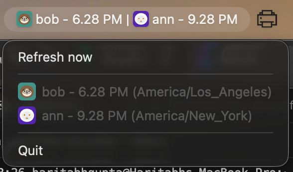

<div align="center">

<picture>
  <source media="(prefers-color-scheme: dark)" srcset="assets/brand/lockup/theirtime-lockup-dark.png">
  
</picture>

</div>

<p align="center">
  <em>Stop opening Slack profiles to guess if it's a reasonable hour.</em><br>
  Your hour in white · their hour in amber — Slack avatars in your menu bar, no server.
</p>

<div align="center">



</div>

<p align="center">
  <a href="https://github.com/haritabh17/theirtime/releases"></a>
  &nbsp;
  <a href="#"></a>
  &nbsp;
  <a href="LICENSE"></a>
</p>

## Quick start

**1. Install**

```bash
curl -fsSL \
  https://raw.githubusercontent.com/haritabh17/theirtime/main/scripts/install.sh \
  | bash
```

macOS only · installs `theirtime` to `/usr/local/bin`

**2. Connect Slack** — your app, your Keychain

```bash
theirtime onboard
```

Opens a pre-filled Slack app manifest, then OAuth.

**3. Add a teammate**

```bash
theirtime team add bob U012ABCDEF
```

> **Member ID:** Slack profile → **⋮** → *Copy member ID* (`U012ABCDEF`)

**4. Start the menu bar**

```bash
theirtime install-agents
```

Registers LaunchAgents so the menu bar runs when your team list isn't empty.

Run `theirtime status` to confirm everything's wired up.

## Display

> Default: **`[avatar] 4.07 PM`** in the menu bar — turn names on with `show_name true`.  
> Menu bar refreshes every minute · Slack avatars every 15 minutes.

```bash
theirtime config set show_name true
theirtime config set format_24h true
theirtime config set time_precision hours
theirtime install-agents
```

| You want | Set |
|:--|:--|
| Names in the bar | `show_name true` |
| 24-hour clock | `format_24h true` |
| Hour only (`4 PM`) | `time_precision hours` |
| Avatar + name + time | `show_avatar true` · `show_name true` · `show_time true` |

`theirtime config get` · `theirtime config set show_avatar|show_name|show_time|format_24h|time_precision …`

## Commands

| Command | Purpose |
|:--|:--|
| `theirtime team list` · `team remove <label>` | Manage watched teammates |
| `theirtime status` | Config, Keychain, and agent state |
| `theirtime auth` | Re-authorize Slack |
| `theirtime offboard` | Uninstall everything |
| `theirtime menubar --demo` | Preview the menu bar without Slack |

Logs · `~/Library/Logs/theirtime/menubar.log`

## Privacy & develop

Keychain for secrets · `~/Library/Application Support/theirtime/config.yaml` for prefs · OAuth on `127.0.0.1:8765` only · no telemetry.

```bash
make build && ./bin/theirtime menubar --demo
```

[`manifest/theirtime.manifest.yaml`](manifest/theirtime.manifest.yaml) · [Releases](https://github.com/haritabh17/theirtime/releases) · [CLI plan](docs/PLAN-cli.md)
